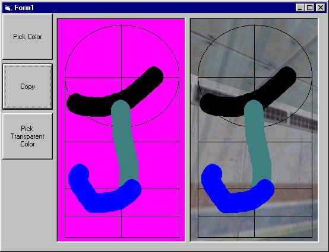



## REALLY COOL\. Images /w transparent colors\!

### Description

This code copys a image /w a transparent color(pink or a user selected color) to another picture box without the color thats transparent.(see screenshot)
 
### More Info
 
This code uses the Windows API TransparentBlt Function.

             |
---                |---
**Submitted On**   |2003-01-11 20:17:14
**By**             |[Jimmy Kelly](https://github.com/Planet-Source-Code/PSCIndex/blob/master/ByAuthor/jimmy-kelly.md)
**Level**          |Beginner
**User Rating**    |5.0 (10 globes from 2 users)
**Compatibility**  |VB 5\.0, VB 6\.0
**Category**       |[Graphics](https://github.com/Planet-Source-Code/PSCIndex/blob/master/ByCategory/graphics__1-46.md)
**World**          |[Visual Basic](https://github.com/Planet-Source-Code/PSCIndex/blob/master/ByWorld/visual-basic.md)
**Archive File**   |[REALLY\_COO1527581112003\.zip](https://github.com/Planet-Source-Code/jimmy-kelly-really-cool-images-w-transparent-colors__1-42356/archive/master.zip)

